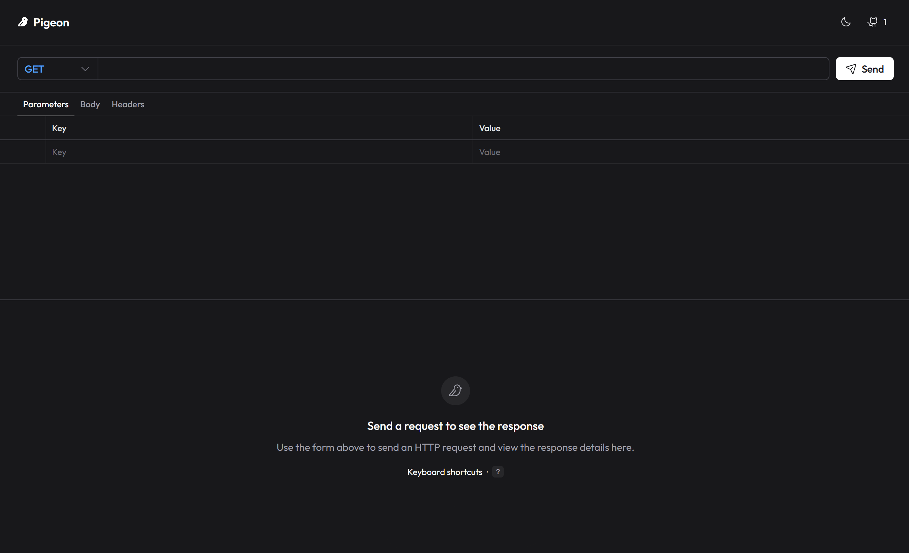

  

### **Pigeon REST**

**A lightweight open-source alternative to Postman and Insomnia.**

  

    <a href="#">
      <picture>
        
      </picture>
    </a>
  

## ✨ Features

🌐 **HTTP Methods**:

- `GET` - Requests a representation of the specified resource
- `POST` - Submits an entity to the specified resource, often causing a change in state or side effects on the server
- `PUT` - Replaces all current representations of the target resource with the request content
- `PATCH` - Applies partial modifications to a resource
- `DELETE` - Deletes the specified resource
- `HEAD` - Asks for a response identical to a `GET` request, but without a response body
- `OPTIONS` - Describes the communication options for the target resource

🐦 **Request**:

- Change HTTP method, URL, query parameters, headers, and body with a user-friendly interface.
- Support for various body types: JSON, XML, HTML and plain text.

📨 **Response**:

- View response status, headers, and body in a clean, organized layout.
- Syntax highlighting for JSON, XML, HTML, and plain text responses.
- Preview special content types (e.g., images, PDFs, etc...) directly in the app.

🛡️ **Smart Proxy**: Bypass CORS and capture low-level network details.

💅 **Modern UI**: Built with minimalistic components, dark-mode ready interface.

## 🛠️ Tech Stack

- **Framework**: [Nuxt 4](https://nuxt.com)
- **UI Library**: [Nuxt UI](https://ui.nuxt.com)
- **Editor**: [CodeMirror](https://codemirror.net)
- **Validation**: [Valibot](https://valibot.dev)
- **HTTP Client**: [Got](https://github.com/sindresorhus/got) (Server-side)
- **Icons**: [Phosphor Icons](https://phosphoricons.com) (via Nuxt UI)

## 🤝 Contributing

Contributions are welcome! Please feel free to submit a Pull Request.

1. Fork the project
2. Create your feature branch (git checkout -b feat/amazing-feature)
3. Commit your changes (git commit -m 'feat: add some amazing-feature')
4. Push to the branch (git push origin feat/amazing-feature)
5. Open a Pull Request

## ⚖️ License

Distributed under the [MIT License](https://opensource.org/licenses/MIT). See [`LICENSE`](LICENSE) for more information.
